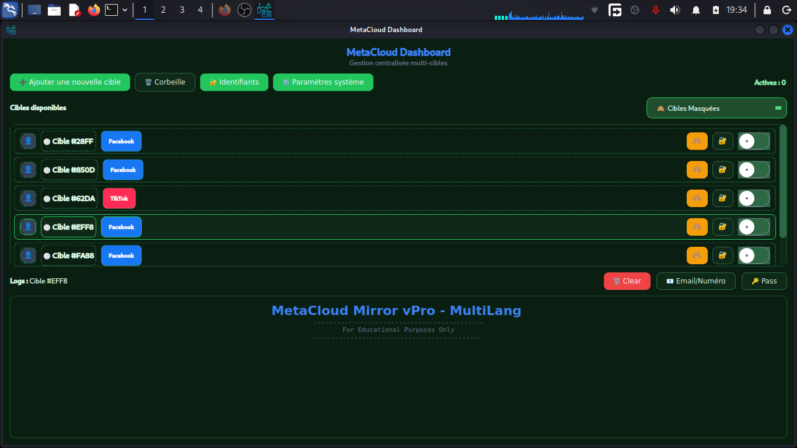
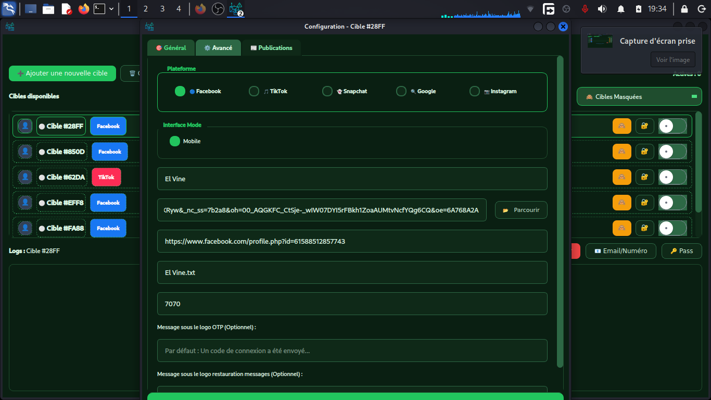
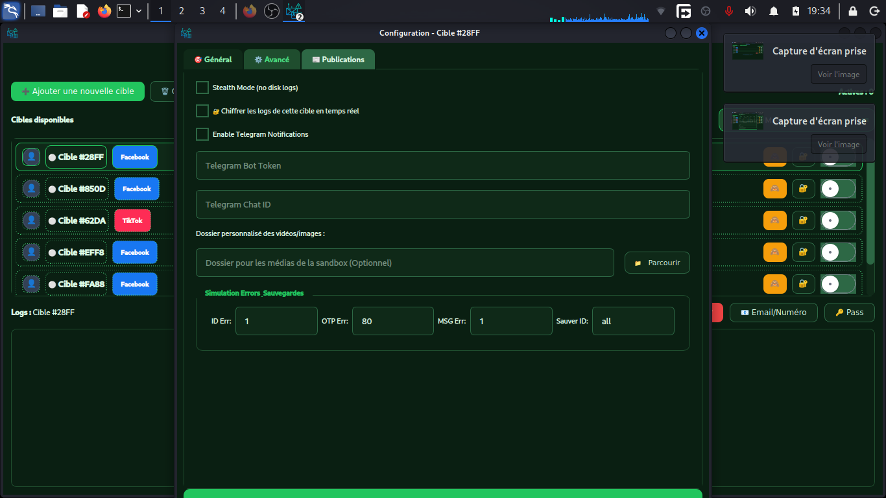
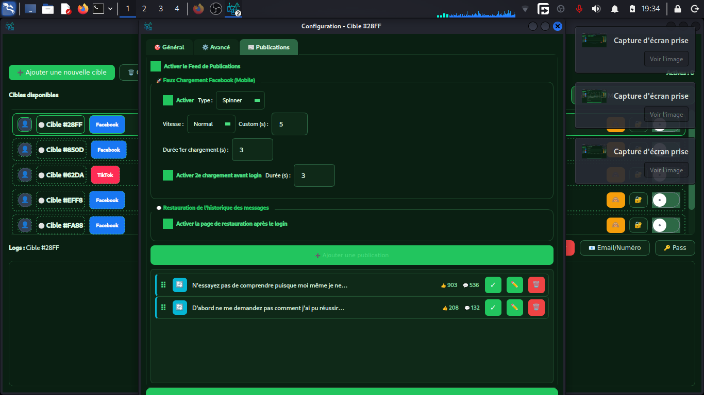
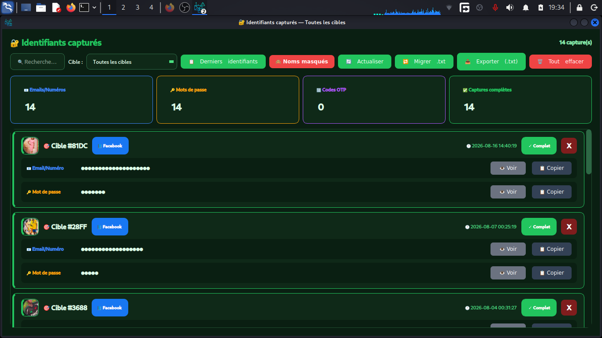
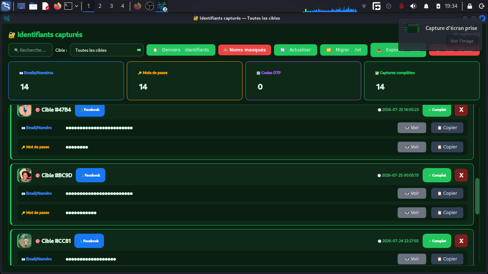
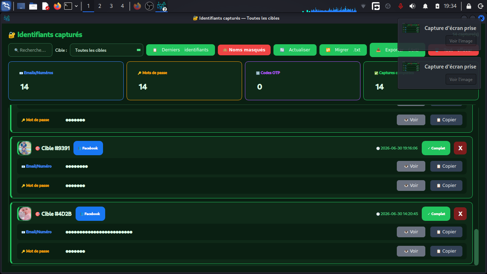

# MetaCloud

> Plateforme de recherche et de sensibilisation à la sécurité face aux attaques par ingénierie sociale.

[](https://www.python.org/)
[](#cadre-dutilisation)
[](./LICENSE)

## Présentation

MetaCloud est un projet expérimental destiné à aider les chercheurs, les étudiants et les équipes de sécurité à comprendre les mécanismes visuels et comportementaux utilisés dans les campagnes d’hameçonnage. Il doit être utilisé exclusivement dans un environnement contrôlé, avec une autorisation explicite et documentée.

Le projet n’est pas un service de collecte de comptes, n’est pas destiné à l’usurpation de plateformes tierces et ne doit jamais être déployé contre des utilisateurs, des systèmes ou des services sans consentement préalable.

## Objectifs pédagogiques

- Étudier les signaux qui permettent d’identifier une page ou un parcours frauduleux.
- Former les utilisateurs à la vérification des URL, des domaines et des demandes d’authentification.
- Reproduire des scénarios de sensibilisation dans un laboratoire isolé.
- Améliorer les procédures de détection, de signalement et de réponse aux incidents.

## Cadre d’utilisation

L’utilisation de MetaCloud est limitée aux contextes suivants :

- laboratoire personnel isolé ;
- démonstration locale et non connectée à des services réels ;
- audit de sécurité autorisé par écrit ;
- formation approuvée par le propriétaire des systèmes concernés.

Il est strictement interdit de :

- demander, enregistrer, stocker ou exfiltrer de vrais identifiants ;
- viser un compte, une personne, une organisation ou une plateforme sans autorisation ;
- usurper une marque ou un service dans le but de tromper un utilisateur ;
- utiliser le projet pour accéder à un compte, contourner une authentification ou compromettre un système ;
- publier, redistribuer ou modifier le projet en dehors des conditions de la licence ci-dessous.

L’auteur décline toute responsabilité en cas d’utilisation illégale, non autorisée ou contraire à la présente documentation. Vérifiez également les lois et règles applicables dans votre juridiction.

## Captures d’écran

Les visuels ci-dessous correspondent à l’interface du projet. Ils sont affichés depuis les fichiers versionnés dans ce dépôt afin de rester visibles directement sur GitHub.















## Démonstrations vidéo

GitHub ne garantit pas l’affichage intégré des fichiers vidéo dans tous les contextes. Les démonstrations sont donc proposées sous forme de liens directs :

- [Voir la présentation de l’interface](./2026-09-23%2018-29-15.mp4)
- [Voir la démonstration en environnement local autorisé](./2026-09-23%2019-02-25.mp4)

Ces vidéos ne constituent pas une autorisation d’utiliser le projet sur des services réels.

## Installation pour revue en laboratoire

L’installation ne doit être réalisée que dans un environnement isolé et dédié à la recherche. Utilisez une version prise en charge de Python, puis créez un environnement virtuel :

```bash
git clone https://github.com/Rift-Ops/MetaCloud.git
cd MetaCloud
python3 -m venv .venv
source .venv/bin/activate
python -m pip install --upgrade pip
python -m pip install -r requirements.txt
```

Avant toute exécution, inspectez le code, désactivez tout accès à des services réels et utilisez uniquement des données fictives. Ne lancez jamais le projet sur un réseau ou un domaine qui ne vous appartient pas ou pour lequel vous ne disposez pas d’une autorisation écrite.

## Structure indicative

| Élément | Rôle |
| --- | --- |
| `Release.py` | Point d’entrée de l’application expérimentale |
| `requirements.txt` | Dépendances Python |
| `assets/` | Ressources visuelles |
| `platforms/` | Composants liés aux scénarios de test |
| `templates_parts/` | Éléments d’interface |
| `static/` | Ressources statiques |

## Signalement responsable

Si vous découvrez un problème de sécurité dans ce dépôt, n’exploitez pas la vulnérabilité. Ouvrez une issue avec un minimum de détails non sensibles ou contactez le mainteneur via son profil GitHub. Ne joignez jamais de mots de passe, jetons, données personnelles ou preuves contenant de véritables identifiants.

## Contributions

Les contributions doivent rester strictement défensives et pédagogiques. Toute proposition qui facilite la collecte d’identifiants réels, l’usurpation d’un service ou le déploiement contre des tiers sera refusée.

## Licence

MetaCloud est distribué sous une licence propriétaire et restrictive. Toute copie, republication, modification, redistribution, revente, sous-licence ou intégration dans un autre projet est interdite sans autorisation écrite préalable du détenteur des droits. Consultez le fichier [LICENSE](./LICENSE).

## Avertissement

Ce dépôt est fourni à des fins de recherche et de sensibilisation uniquement, sans garantie. La possession ou l’utilisation de cet outil ne confère aucun droit d’accès à un compte ou à un système tiers.
